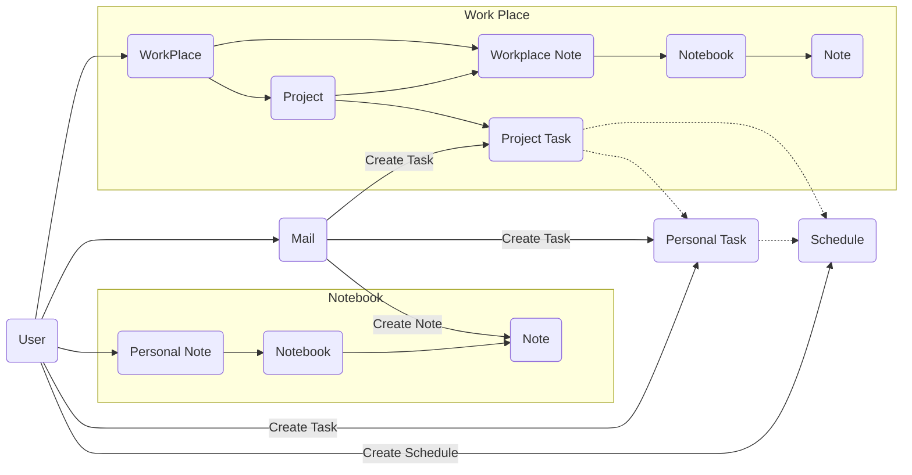
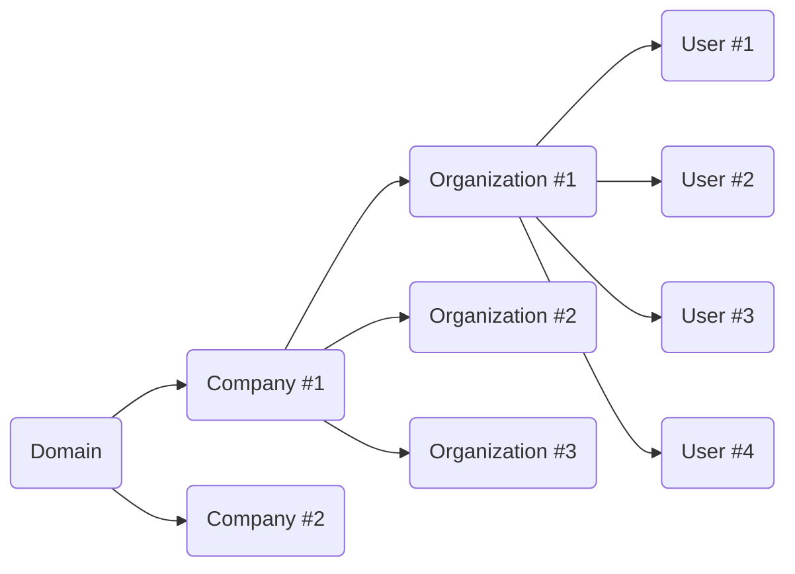

## 기능정의
### 컨텐츠 플로우

- 워크 플레이스
    - 각 모든 기능에 대한 워크 플레이스로 구분 할 수 있도록
- 메일
    - 자체 메일 서버 구축은 추후
    - POP3 / IMAP 프로토콜을 통한 타 메일 시스템과 연동
    - 메일 수신시 필터 기능을 통한 자동화 기능(작업으로  등록 등)
    - 메일을 통한 작업 등록 기능 (개인 / 프로젝트 모두)
- 작업관리
    - 프로젝트 구성 가능
        - 프로젝트별 작업 관리 기능
        - Splint 등과 같은 RoadMap(MileStone) 구분 필요
    - 개인 작업 관리 기능
        -  INBOX (여러곳의 할 일을 수집 - 수동 / 자동)
- 일정관리
    - 개인 일정 관리
    - 프로젝트 일정 관리 (프로젝트 작업과 자동 연동)
    - 작업 일정 관리 (개인 작업과 자동 연동)
- 노트
    - 노트북으로 그룹 관리 가능
    - 태그 기능 필요
    - 통합 검색
    - MarkDown / Html Editor 전환 가능

* 각 기능간 상호 연계 기능 구상 필요
> 우선은 기본 기능 구현을 우선할 것

## 시스템 모듈
### 시스템 아키텍처
- MSA 기반 시스템 구축
    - Spring Cloud Netflix 기반
    - Zuul Proxy / Eureka / Config Server / Hystrix
- F/E VueJS 기반 시스템 구축
    - API 통신을 위해 AXIO 사용
- 모든 프로젝트 / 모듈 Lint / Test Framework 적용할 것(필수 - 선 개발 후 적용이라도 할 것)

### 인증
- oAuth2 기반 Client App / 사용자 인증 구성
    - 암호화 방식 선정 필요(SHA512 / SEED / AES256 / TripleDES 중 택1)
    - 기초 구상: DB 저장 암호화 단방향 / 통신 전달시 양방향
- 사용자 관리 모델
    - 멀티 테넌시 가능하도록 구성
    - 테넌시 별 다중 컴퍼니 가능토록 구성

### 컨텐츠 관리
- 필수 컨텐츠: 메일 / 개인 작업 관리 / 노트
- 선택 컨텐츠: 프로젝트 外 추가 컨텐츠
    - 선택 컨텐츠의 설정은 최고 관리자 / 도메인 관리자로 국한
    - 컨텐츠 표시 여부는 개인이 설정 가능토록
- 컨텐츠 모듈은 확장 가능한 형태로 구성
    - 플러그인 또는 마켓플레이스 유형

### 디버깅 서비스
#### 디버깅 서버
- 디버깅을 위한 로깅 서비스
- 기록된 로깅 검색 및 분석 서비스
- Trace History 기록 등 상세 스펙 정의 필요

#### 로깅 서비스
- Application Logging 서비스
- Console, File, DB 등 연동 필요
- ELK Stack 고려
